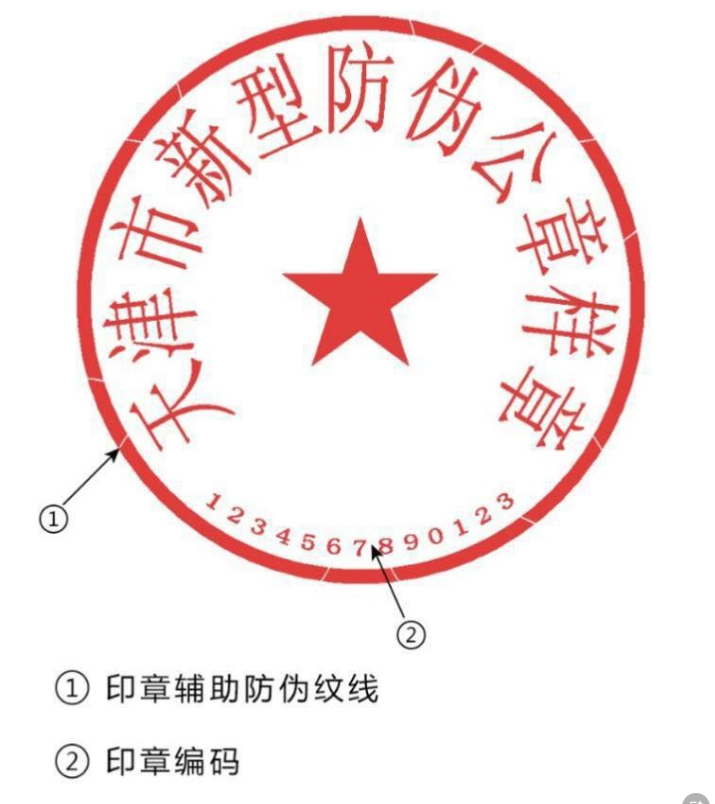
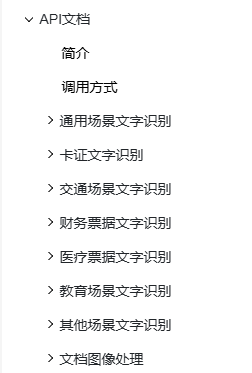
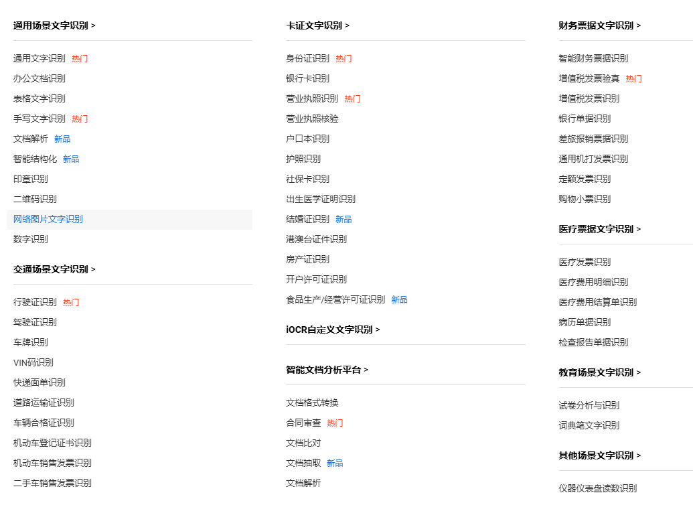
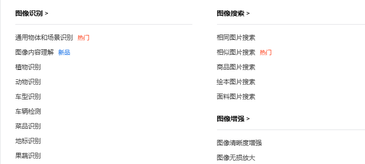

# 图片

## 印章检测与识别

检测并识别合同文件或常用票据中的印章，输出文字内容、印章位置信息以及相关置信度，支持识别印章编码，可覆盖圆形章、椭圆形章、方形章等常见种类的印章。

## 二维码识别

对图片中的二维码、条形码进行检测和识别，返回存储的文字信息及其位置信息

## 图片智能结构化

支持智能提取图片中的字段结构化信息，无需训练灵活提取。适用于各类证照、票据、表单等版式中的结构化信息录入场景。

## 图文检索

相似图片搜索，以图搜图，以文搜图

## 图像清晰度增强、图像修复

可用于提升网站图片、手机相册图片、视频抽帧的图像质量，对压缩后变模糊的图片进行智能去噪，强化图像纹理细节，使图像画面更加清晰

集成到图像美化、创意处理等软件中，对用户上传的照片进行处理，去除图像中不需要的遮挡物；也可用于内容生产平台、图像处理厂商提升图像质量

## 图片水印去除、视频水印去除

去除图片、视频中的水印

## 视频字幕去除

## 其它更多图片识别相关内容

(https://ai.baidu.com/ai-doc/OCR/Mltqmoc3o)[https://ai.baidu.com/ai-doc/OCR/Mltqmoc3o]

以上模型均支持本地部署、定制化训练。需客户自己提供训练数据

# 语音

## 语音识别

支持普通话和略带口音的中文识别；支持粤语、四川话方言识别；支持英文识别等多种方言和小语种

## 语音合成

提供40余种风格多样的发音人供您选择，适用于有声阅读、新闻播报、订单播报、智能硬件等各类应用场景
支持多种参数配置，可根据场景需求对音库的语速、音调、音量进行灵活设置，满足个性化需求

## 实时语音对话

支持语音实时AI交互，可应用于电话客服等场景

# 翻译

## 文本翻译、文档翻译
支持200+语种互译，传入待翻译内容，并指定源语言（支持语种自动检测）和目标语言，即可获得翻译结果，并支持术语干预

# 自然语言处理

## 文本纠错
准确识别出文本中出现的字词或标点错误，并针对性给出正确的建议文本内容，在搜索引擎、语音识别、内容审核等场景有广泛应用

支持字词、标点、专名、数值内容纠错，适用于公文、官方文稿场景纠错，并为更多场景提供专属定制服务

## 实体抽取

提供业界领先的中文命名实体识别技术，从非结构化的文本中抽取命名实体，进而应用于文本理解、意图理解、舆情分析、对话NLU等任务

基于百科知识库，将实体关联到知识库中的实体对象，可用于搜索、推荐、广告、对话等多种场景下的知识解析任务，进而更好的解决应用问题

## AI对话

大模型文本对话，内容生成，可根据客户知识库定制化

# AIGC

## 图文素材转视频

AI智能化理解用户输入的图文素材，智能匹配图片与文字，保障视频内容清晰有逻辑
图文素材全自动化生成视频，无需手动剪辑，帮助您零门槛进行视频创作
支持调整视频配音音色、视频长度、视频尺寸、添加数字人等参数，满足用户个性化需求

## AI作画
AI一下，文字成画，AI 精准理解中文文本，支持用户自由输入，只需一句话，让文字秒变精美画作

除以上内容外，还有未列举出的ai应用，均可实现及定制化服务
