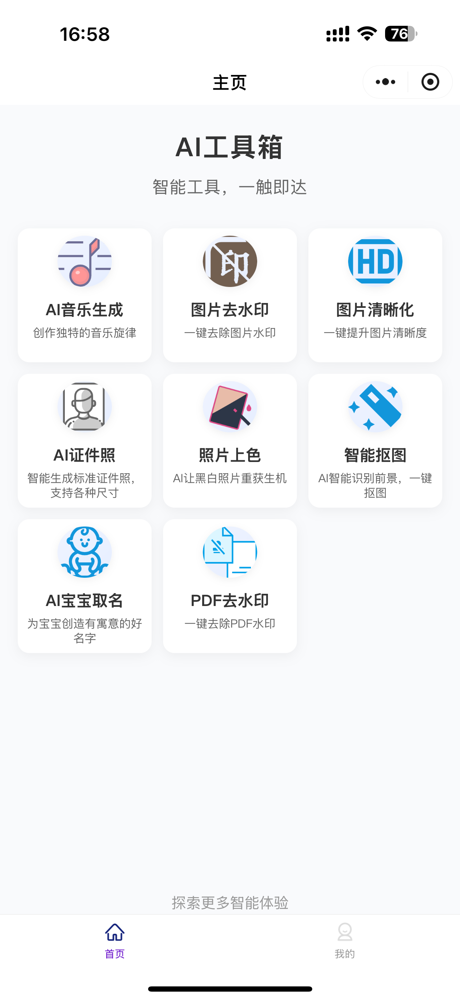

# AI实用宝小程序

AI实用宝是一个基于微信小程序平台的AI工具箱应用，为用户提供多种实用的AI驱动工具，帮助用户解决日常生活和工作中的各种问题。

## 项目概述

本项目是一个集成多种AI功能于一体的智能工具箱，以"智能工具，一触即达"为核心理念，通过简洁直观的界面，让用户轻松体验AI技术带来的便利。已完成微信支付接入，可实现功能付费和会员订阅，具备完整的商业变现能力。

## 主要功能

AI实用宝小程序提供以下核心功能：


### AI音乐生成
提供三种音乐创作模式：
- **灵感模式**：只需描述想要的音乐风格，AI自动生成完整歌曲
- **定制模式**：可自定义歌词、风格标签和歌曲标题
- **续写模式**：基于已有歌曲进行创意续写，延续原曲风格
- 支持纯音乐(不含歌词)的生成
- 生成结果可下载、分享和续写

### 图片去水印
- 自动模式：AI自动识别并去除图片上的水印
- 手动模式：用户框选水印区域进行精准去除
- 支持多个水印区域同时处理
- 提供处理结果预览和保存功能

### 图片清晰化
- 提升模糊图片的清晰度和分辨率
- 支持通用清晰化和人像清晰化两种模式
- 提供1倍、2倍、4倍多种放大倍数选择
- 处理结果支持原图对比查看效果
- 优化图像细节，修复失真区域

### AI证件照
- 智能生成各种规格的标准证件照
- 支持选择多种底色(蓝色、红色、白色等)
- 可自定义底色RGB值
- 支持自定义照片尺寸
- 提供PNG和JPG两种输出格式

### 照片上色
- 将黑白老照片转换为彩色照片
- 智能识别内容并添加自然色彩
- 提供原图与上色后的对比预览
- 支持JPG、PNG和WebP输出格式

### 智能抠图
- AI智能识别前景，一键完成抠图
- 支持多种前景类型(人物、物品、动物等)
- 提供透明背景输出(PNG格式)
- 可选择自定义背景颜色(JPG格式)
- 支持多种裁剪和输出选项

### 图片添加背景
- AI智能为图片添加自然美观的背景
- 支持自定义背景描述提示词
- 可同时生成多张不同风格的结果(1-4张)
- 支持批量保存或单独保存生成结果
- 适用于产品展示、人像美化等场景

### AI宝宝取名
- 根据姓氏、性别生成个性化名字推荐
- 可指定必须包含的汉字
- 支持添加其他命名要求(如寓意要求)
- 每个名字提供完整的寓意解析和字义分析
- 保存历史生成记录，方便查询和筛选

### PDF去水印
- 一键去除PDF文档中的水印
- 支持密码保护的PDF文件处理
- 处理完成后可直接下载无水印PDF
- 提供文件大小和页数信息

## 商业变现

### 完整的支付系统
- **微信支付接入**：已完成微信小程序支付接口对接，支持各种支付场景
- **积分充值**：用户可通过微信支付购买不同额度的积分套餐
- **按需付费**：不同AI功能消耗不同积分，按实际使用计费
- **功能订阅**：支持推出会员订阅服务，享受特定功能的无限使用权


## 技术架构

### 前端技术栈

- **开发框架**: uni-app（支持多端开发）
- **编程语言**: Vue 3（支持Vue 2兼容模式）
- **UI设计**: 自定义UI组件
- **状态管理**: Vue全局状态管理

### 项目结构

```
front/
├── api/                              # API接口封装
│   ├── chatbotApi.js                 # 聊天机器人API
│   ├── feedbackApi.js                # 用户反馈API
│   ├── musicApi.js                   # 音乐生成API
│   ├── nameGeneratorApi.js           # 宝宝取名API
│   ├── pdfWatermarkApi.js            # PDF去水印API
│   ├── pointsApi.js                  # 积分系统API
│   ├── userApi.js                    # 用户管理API
│   └── visualApi.js                  # 图像处理相关API
├── components/                       # 组件目录
│   ├── LoginConfirmPopup.vue         # 登录确认弹窗组件
│   └── PointsConfirmPopup.vue        # 积分确认弹窗组件
├── pages/                            # 页面目录
│   ├── about/                        # 关于我们页面
│   ├── agreement/                    # 用户协议与隐私政策页面
│   ├── background/                   # 图片添加背景功能页面
│   ├── chatbot/                      # 智能聊天机器人页面
│   ├── customer-service/             # 客服联系页面
│   ├── feedback/                     # 意见反馈页面
│   ├── follow/                       # 关注公众号页面
│   ├── home/                         # 首页
│   ├── id-photo/                     # AI证件照功能页面
│   ├── image-colorization/           # 照片上色功能页面
│   ├── image-enhancer/               # 图片清晰化功能页面
│   ├── image-segmentation/           # 智能抠图功能页面
│   ├── login/                        # 登录页面
│   ├── music-generator/              # AI音乐生成功能页面
│   ├── my/                           # 个人中心页面
│   ├── name-generator/               # AI宝宝取名功能页面
│   ├── pdf-watermark/                # PDF去水印功能页面
│   ├── points/                       # 积分记录页面
│   ├── purchase/                     # 积分购买页面
│   ├── register/                     # 用户注册页面
│   ├── user/                         # 用户信息管理页面
│   └── visual-processor/             # 图片去水印功能页面
├── static/                           # 静态资源
├── utils/                            # 工具函数
│   ├── config.js                     # 配置文件
│   ├── platform.js                   # 平台判断工具
│   ├── pointsService.js              # 积分服务工具
│   ├── request.js                    # 网络请求工具
│   └── uploadHelper.js               # 文件上传工具
├── App.vue                           # 应用入口组件
├── main.js                           # 主入口文件
├── manifest.json                     # 应用配置文件
├── pages.json                        # 页面路由配置
├── uni.scss                          # 全局样式变量
└── uni.promisify.adaptor.js          # Promise适配器
```


## 在线体验

- 在微信中搜索"AI实用宝"小程序


## 页面

<details>
<summary>点击查看页面截图</summary>





</details>


## Buy me a coffee


## 联系作者

添加请备注来意


